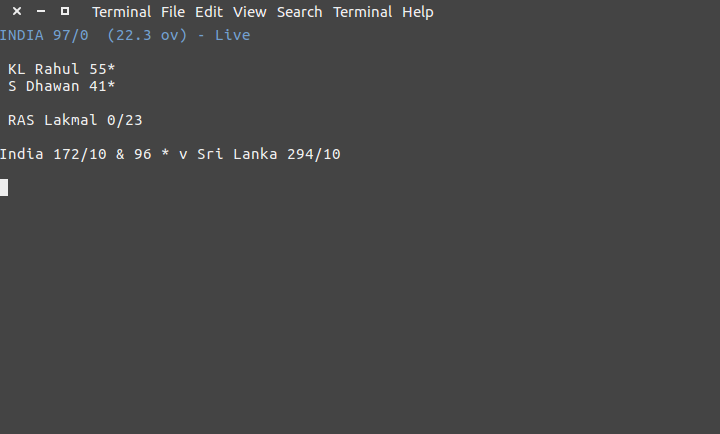

# CRICKET-CLI

This is a command line application, using [Node.js](http://nodejs.org/), that tracks live cricket scores.

### What




### How

1. Install

    ```npm install```

2. Run

    ```node app.js```

### Data

All data is from the [CricScore API](http://cricscore-api.appspot.com/) :heart: